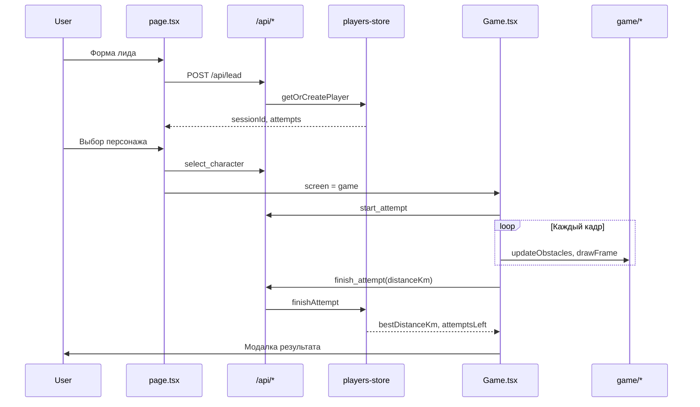

# Вектор · Pixel Driver Game

Посадочная страница с пиксельной runner-игрой для сбора лидов автошколы «Вектор» (в коллаборации с брендом «Кодик»). Игрок заполняет форму, выбирает персонажа (Векта/Кодик), бежит по трассе, перепрыгивая препятствия, и по лучшему результату получает промокод на скидку до 5000 ₽.

Полное ТЗ: [Google Doc](https://docs.google.com/document/d/11olWlfgx4CENLbWTwVm6CMtJFFuNCF_A4sLtWyuoZY8/edit). Ссылки на разделы ТЗ в коде помечены как «(ТЗ N)».

> **Статус:** фронтенд и базовый бэкенд (Supabase, `POST /api/lead`, `POST /api/game-update`) реализованы. Интеграции amoCRM, Google Sheets и аналитика — в планах.

## Стек

- **Next.js 16** (App Router) + **React 19** + **TypeScript**
- **Tailwind CSS 4** — вёрстка, mobile-first
- **HTML5 Canvas** — игровой рендер (без Phaser, по решению команды)
- **ESLint** (`eslint-config-next`)

## Быстрый старт

Нужен **Node.js 20+** (версия зафиксирована в [.nvmrc](.nvmrc)).

```bash
npm install        # установить зависимости
npm run dev        # запустить дев-сервер
```

Открой <http://localhost:3000> — стартовый экран игры.

### Команды

| Команда                  | Что делает                              |
| ------------------------ | --------------------------------------- |
| `npm run dev`            | Дев-сервер с hot reload                 |
| `npm run build`          | Прод-сборка                             |
| `npm run start`          | Запуск прод-сборки                      |
| `npm run lint`           | Проверка ESLint                         |
| `npm run optimize-images`| Сжатие тяжёлых PNG в `public/` (sharp)  |

### Переменные окружения

Понадобятся для работы с бэкендом. Скопируй шаблон и заполни:

```bash
cp .env.example .env.local
```

| Переменная                   | Где используется        | Описание                          |
| ---------------------------- | ----------------------- | --------------------------------- |
| `SUPABASE_URL`               | `lib/supabase-server`   | URL проекта Supabase              |
| `SUPABASE_SERVICE_ROLE_KEY`  | `lib/supabase-server`   | Service role key (только сервер)  |

`.env.local` в git не коммитится. **Все ключи интеграций — только на сервере** (без префикса `NEXT_PUBLIC_`), ТЗ 2.2 и 15.

## Структура проекта

```
src/
  app/
    api/
      lead/route.ts         # POST /api/lead — регистрация лида, создание/поиск игрока
      game-update/route.ts  # POST /api/game-update — игровые действия по sessionId
    layout.tsx              # корневой layout (lang="ru", метаданные)
    page.tsx                # роутер экранов, гидрация сессии из localStorage
    globals.css             # Tailwind + базовые стили
  components/               # переиспользуемые UI-компоненты
  game/                     # игровой движок (логика, рендер, генерация) — см. ниже
  lib/                      # бизнес-логика, API-клиент, работа с Supabase — см. ниже
  screens/                  # полноэкранные экраны приложения
public/                     # статические ассеты (фоны, спрайты, SVG-рамки)
scripts/
  optimize-public-images.mjs  # офлайн-сжатие PNG
```

<!-- Рекомендация по мере роста: компоненты экранов — в `src/components/`, игровую логику (Canvas, физику, генерацию препятствий) — в отдельном модуле `src/game/`, общие типы и константы — в `src/lib/`. Бэкенд (Route Handlers) — в `src/app/api/`. -->

<!-- ## Что делать дальше

Каркас даёт запускаемую страницу и справочник констант из ТЗ. Дальше по приоритету:

1. **Разбить на 6 экранов** (ТЗ 3): стартовый → форма → выбор персонажа → игра → завершение попытки → победа. Состояние экрана + компоненты в `src/components/screens/`.
2. **Форма лида** (Экран 2): валидация, маска телефона, обязательный чекбокс согласия, honeypot (ТЗ 15).
3. **Игровая механика** (ТЗ 4–5): генерация 8 типов препятствий, столкновения, рост сложности, pop-up на чекпоинтах (ТЗ 6). Препятствия не должны создавать непроходимых комбинаций.
4. **Экраны завершения** (ТЗ 7): результат + скидка, до 3 попыток, победный экран на 5000 км, промокод `VECTOR-[СКИДКА]-XXXX` (ТЗ 8).
5. **Бэкенд** (ТЗ 9): эндпоинты `POST /api/lead` и `POST /api/game-update` в `src/app/api/` (Route Handlers). Серверная проверка лимита 3 попыток на номер и валидация дистанции/`session_id` — обязательны (anti-cheat, ТЗ 4.2).
6. **Интеграции**: amoCRM (ТЗ 10), Google Sheets (ТЗ 11), Яндекс.Метрика + VK Pixel (18 событий, ТЗ 12). -->
<!-- 
Спрайты, цвета и экраны берём из отдельного документа «ТЗ для графических дизайнеров». Критерии приёмки — раздел 16 ТЗ. -->

 **Ограничение концепции:** запрещено копировать Google Dino (динозавр, кактусы, птицы, ассеты Google). Мир игры — оригинальный, на основе бренда «Вектор»/«Кодик».


## Техническая документация компонентов

### AccentText

AccentText — это простой презентационный компонент, предназначенный для отображения текста с акцентным стилем. Он используется в интерфейсе для выделения ключевых фраз, заголовков или коротких сообщений.

Компонент гарантирует единый стиль для всех акцентных текстов в проекте:

- Шрифт — Press Start 2P (пиксельный, ретро‑игровой стиль).

- Цвет — кастомный лаймовый `text-custom-lime`.

### Button

Button — это основной компонент кнопки в проекте. Он используется для всех интерактивных действий (начало игры, активация, отправка формы и т.п.). 

Компонент поддерживает визуальные варианты:

1. **primary (по умолчанию)**
Фон: жёлтый `bg-custom-yellow`, при наведении — тёмно‑жёлтый `hover:bg-custom-yellow-hover`, при нажатии — ещё темнее `active:bg-custom-yellow-pressed`.

2. **secondary**
Фон: кремовый `bg-cream-text`, при наведении — темнее `hover:bg-cream-button-hover`, при нажатии — ещё темнее `active:bg-cream-button-pressed`.

3. **disabled**
- Фон: серый `bg-disabled`.
- Курсор: not-allowed.
- Анимация: отключена (`hover` и `active` не срабатывают).

### CharacterSelector

Выбор персонажа на мобильных устройствах. Отображает две карточки (Векта и Кодик) с возможностью выбора через клик.

Особенности:
- Фиксированные размеры карточек: 158×280px.
- При выборе появляется свечение (красное для Векты, зелёное для Кодика).
- Не адаптивен — предназначен только для мобильных экранов (скрывается на десктопе через `md:hidden`).

### CharacterSelectorMain

Выбор персонажа на десктопных устройствах. Отображает две карточки с адаптивными размерами (`max-h-[354px]`, `max-w-[282px]`), центрирует их в контейнере.

Особенности:
- Использует object-contain для сохранения пропорций изображений.
- Свечение при выборе — аналогично мобильной версии.

###  CopyButton

Кнопка для копирования текста (промокода) в буфер обмена.

Доступность:
- `aria-label` меняется в зависимости от состояния (Скопировано / Скопировать промокод).
- Кнопка имеет тип `button` и не отправляет форму.

### FieldError

Компонент для отображения ошибки валидации поля формы. Содержит иконку восклицательного знака и текст ошибки.

### Input

Кастомное поле ввода с поддержкой лейбла, ошибки и адаптивных стилей. Использует шрифт Handjet для ретро-стиля.

Особенность:

- При наличии ошибки в поле ввода добавляется красная обводка и отображается <FieldError>.

###  Modal

Модальное окно с тремя предустановленными размерами (`default`, `discount`, `gameover`). Поддерживает адаптивные рамки (мобильные/десктопные), закрытие по Escape и клику на фон.

Пропсы:

| Имя                                            | Тип                                   | Обязательный    | Описание                                |
| ---------------------------------------------- | ------------------------------------- | --------------- | --------------------------------------- |
| `open`                                         | `boolean`                             |       ✅        | Управляет видимостью модалки	           |  
| `children`                                     | `ReactNode`                           |       ✅        | Содержимое модалки                       |
| `title`                                        | `string`                              |       ✅        | Заголовок (отображается зелёным цветом)  |
| `onClose`                                      | `() => void`                          |       ✅        |	Callback при закрытии                    |
| `size`                                         | `"default" / "discount" / "gameover"` |       ❌	      | Предустановленный размер                 |
| `borderSrc / borderDesktopSrc`                 | `string`                              |       ❌	      | Пути к кастомным рамкам                  |
| `className / panelClassName / borderClassName` | `string`                              |       ❌        |	Дополнительные стили                     |
| `closeOnBackdrop`                              | `boolean`                             |       ❌        |	Закрытие по клику на фон                 |


### ProgressBar

Прогресс-бар для отображения пройденного расстояния (например, пробега в игре). Управляется через ref `ProgressBarHandle`.

Методы:
- `setValue(value: number)` – обновляет прогресс (значение от 0 до max).

### Promo

Блок для отображения промокода с кнопкой копирования. Поддерживает три размера: `small`, `medium`, `large`.

### Push

Всплывающее уведомление о достижении промежуточной цели в игре. Отображает сообщение и размер открытой скидки.

## Техническая документация экранов

### Start

Start — это стартовый экран приложения. Он отображается при первом запуске и служит «визитной карточкой» игры. Содержит заголовок, краткое описание цели и кнопку для перехода к следующему этапу (выбор персонажа или игра). Экран адаптирован под мобильные и десктопные устройства.

### Form

Form — экран для ввода пользовательских данных (имя, фамилия, город, телефон) и согласия на обработку персональных данных. После успешной отправки формы вызывается `callback` с объектом сессии. 

Компонент управляет следующими состояниями:
- values: Значения всех полей формы (`firstName`, `lastName`, `city`, `phone`, `consent`, `honeypot`).
- errors: Ошибки валидации для каждого поля.
- submitted: Флаг, указывающий, была ли форма отправлена (используется для показа ошибок после первой отправки).
- touched: Отслеживает, какие поля были затронуты пользователем (для валидации).
- isSubmitting: Блокирует повторную отправку во время выполнения запроса.
- submitError: Текст ошибки при сбое отправки (сетевой или серверной).

Валидация:
 Используются функции из `@/lib/form-validation`:
 1. `validateLeadField` — валидация отдельного поля.
 2. `validateLeadForm` — валидация всей формы.
 3. `isLeadFormValid`— проверка, что форма валидна (используется для блокировки кнопки).
 4. Обязательные поля: `firstName`, `lastName`, `city`, `phone` (валидация маски + обязательность).
 5. Телефон форматируется через formatPhoneInput (приводит к виду +7 (xxx) xxx xx xx).
 6. Honeypot (скрытое поле) используется для защиты от ботов (не валидируется).


### CharacterMenu

Компонент CharacterMenu отвечает за отображение страницы выбора персонажа перед началом игры. Он предоставляет интерфейс для выбора одного из доступных персонажей.
Компонент полностью адаптивен и использует разные визуальные представления селекторов в зависимости от ширины экрана.

Кнопка "На старт" : Заблокирована, если `!value` (персонаж не выбран).

### Victory

Victory — экран, отображаемый после успешного завершения игры (победы). Позволяет игроку увидеть открытую скидку, скопировать промокод или получить его, если он ещё не был сгенерирован. Экран адаптирован под мобильные и десктопные устройства.

### Game

`Game` — основной игровой экран на HTML5 Canvas. Управляется из `src/screens/Game.tsx`, но вся игровая механика вынесена в `src/game/`.

**Жизненный цикл заезда:**

1. При монтировании вызывается `start_attempt` на сервере.
2. Загружаются ассеты, прескейлятся спрайты, запускается `requestAnimationFrame`-цикл.
3. При столкновении — `finish_attempt` с `reason: "crash"`, затем модалка с результатом.
4. При достижении 5000 км — `finish_attempt` с `reason: "victory"`, переход на экран `Victory`.
5. «Новый заезд» увеличивает `runKey` и перезапускает цикл (без смены экрана).

**Особые случаи:**

- Если `attemptsLeft <= 0` при входе — заезд не стартует, сразу показывается итоговая модалка с лучшим результатом.
- Модалка краша открывается только после успешного ответа сервера на `finish_attempt`.
- При исчерпании попыток без скидки — модалка `gameover` с кнопкой «На главную».

### Completion

Экран «проигрыша» с мемной фразой и кнопкой «Пробовать ещё!». В текущей версии роутер в `page.tsx` на этот экран не переключается — зарезервирован под будущие сценарии.

---

## Поток приложения (`src/app/page.tsx`)

Приложение — SPA без URL-роутинга: активный экран хранится в `useState<Screen>`.

```
start → form → character → game → victory
                              ↘ (crash-модалка, остаёмся на game)
```

**Персистентность сессии** (localStorage):

| Ключ                       | Значение                    |
| -------------------------- | --------------------------- |
| `pixel-runner.sessionId` | UUID сессии игрока          |
| `pixel-runner.screen`      | Текущий экран               |
| `pixel-runner.character`   | Выбранный персонаж          |

При загрузке страницы: если есть `sessionId`, вызывается `fetchSession` (`get_session`), состояние восстанавливается. При невалидной сессии storage очищается, экран сбрасывается на `start`.

`Game` подключается через `dynamic(..., { ssr: false })` — canvas доступен только на клиенте.

---

## Техническая документация: игровой движок (`src/game/`)

Игровой движок отделён от React: `Game.tsx` — оркестратор (загрузка ассетов, цикл, API, UI/HUD), модули в `game/` — чистая логика и рендер.

### Схема данных кадра

Каждый кадр собирает `GameState` и передаёт в `drawFrame`:

| Поле         | Описание                                              |
| ------------ | ----------------------------------------------------- |
| `playerY`    | Вертикальная позиция игрока                           |
| `playerVY`   | Вертикальная скорость                                 |
| `distance`   | Пройденная дистанция в «км» (игровая единица)         |
| `obstacles`  | Массив препятствий на экране                          |
| `bgIndex`    | Индекс текущего фонового слоя (утро → день → вечер → ночь) |
| `bgOffset`   | Смещение параллакс-фона                               |
| `roadOffset` | Смещение текстуры дороги                              |
| `layout`     | Рассчитанный `GameLayout` под viewport                |

Типы — в [`src/game/types.ts`](src/game/types.ts).

### Модули

#### `config.ts`

Глобальные константы: `DISTANCE_GOAL` (5000 км), физика прыжка (`JUMP_BUFFER_MS`, `GROUND_SNAP_EPS`), устаревшие константы канваса (реальный layout — в `layout/`).

#### `layout/`

Адаптивная геометрия игры. `getGameLayout({ w, h })` выбирает mobile или desktop layout (breakpoint 768px).

| Файл               | Назначение                                                                 |
| ------------------ | -------------------------------------------------------------------------- |
| `mobile.ts`        | Базовый layout 360×640, позиции препятствий, скорости                      |
| `desktop.ts`       | Масштабирование под широкий экран (отдельные размеры player/obstacles)     |
| `obstacle-helpers.ts` | Расчёт `groundLine`, `roadDrawH`, фабрика `obstacle()`                |
| `types.ts`         | `GameLayout`, `PlayerLayout`, `WorldLayout`, `SpeedLayout`                 |

`GameLayout` содержит всё, что нужно циклу: размер canvas, хитбокс игрока, размеры 9 типов препятствий, параметры мира (ширина чанка, зазоры, деспавн).

#### `obstacle-defs.ts`

Справочник типов препятствий: размеры спрайта, lane (`ground` / `pit` / `air`), опциональный уменьшенный hitbox.

#### `generator.ts` + `chunk-templates.ts`

Процедурная генерация трассы чанками фиксированной ширины (`chunkWidth` ≈ 860px).

1. `pickTemplate` — выбор шаблона чанка по весам, `distanceKm` и seed (детерминированный PRNG `mulberry32`).
2. `generateChunk` — возвращает `ChunkSpawnItem[]` (тип + `offsetX` внутри чанка). Чанк `0` всегда пустой.
3. `spawnChunkFromItems` — превращает items в runtime-объекты `Obstacle` с координатами и hitbox.

Шаблоны различаются для `mobile` и `desktop` layout id.

#### `chunk-validation.ts`

Проверка проходимости чанка **до** спавна: минимальные зазоры в lane, совместимость ground/pit/air. Если шаблон не проходит — чанк не спавнится (в консоль `warn`).

#### `update.ts`

Движение мира препятствий (hot path, 60 FPS):

- In-place сдвиг `x` и `hitbox.x` на `scrollDelta`.
- Компактификация массива (удаление ушедших за `despawnBehindX`).
- Догенерация чанков, пока `worldEndX < canvas.w + spawnAheadX`.
- Спавн `finish_car` за ~50 км до финиша (без коллизии — декоративный финиш).

Состояние мира — `ObstacleWorld` (массив препятствий, индекс следующего чанка, seed, флаги).

#### `collision.ts`

AABB-пересечение hitbox игрока (`getPlayerHitbox`) с hitbox каждого препятствия. `finish_car` имеет нулевой hitbox.

#### `speeds.ts`

Линейный рост скорости от 0 до 5000 км: фон и препятствия ускоряются пропорционально `distance / DISTANCE_GOAL`.

#### `draw.ts`

Отрисовка одного кадра на canvas (порядок слоёв):

1. Параллакс-фон (`bg-morning` → `bg-day` → `bg-evening` → `bg-night`)
2. Тайлинг дороги
3. Препятствия
4. Анимация бега/прыжка (7 кадров из `RUN_FRAMES`)
5. Debug hitbox (если `DEBUG_HITBOXES`)

Функции `drawableW` / `drawableH` работают и с `HTMLImageElement`, и с offscreen `HTMLCanvasElement` (прескейленные ассеты).

### Оптимизация ассетов в `Game.tsx`

Перед стартом цикла:

- `decode()` всех изображений.
- Препятствия, фоны, кадры бега — bake в offscreen canvas под размер на экране.
- Дорога — bake с ограничением ширины текстуры (`ROAD_TEX_MAX_W = 2048`).

Это снижает decode cost и нагрузку на GPU во время игры.

### Игровой цикл (упрощённо)

```
каждый кадр:
  dt = delta time (cap 50ms)
  scrollDelta = obstacleSpeed * dt
  updateObstacles(world, scrollDelta, distance, layout)
  физика прыжка (playerVY, playerY)
  distance += 0.5 * step          // step = dt * 60
  milestone popup на чекпоинтах скидки (500, 1000, … км)
  if distance >= 5000 → victory
  if isColliding(state) → crash
  drawFrame(ctx, state, assets, now)
```

Физика и скролл привязаны к `dt` (реальное время), baseline — 60 Hz.

---

## Техническая документация: API (`src/app/api/`)

Оба эндпоинта — Next.js Route Handlers (`POST` only). Данные хранятся в Supabase (таблица `players`), доступ через `lib/players-store.ts`.

### `POST /api/lead`

**Назначение:** регистрация лида по телефону, создание или обновление игрока.

**Тело запроса** — поля формы `LeadFormFields`:

```json
{
  "firstName": "Иван",
  "lastName": "Петров",
  "city": "Москва",
  "phone": "+7 (999) 123 45 67",
  "consent": true,
  "honeypot": ""
}
```

**Валидация:** `validateLeadForm` из `lib/form-validation`. При ошибках — `400` с `{ error, errors }`.

**Логика:**

1. Нормализация телефона → ключ игрока (`normalizePhoneDigits`).
2. `getOrCreatePlayer` — новый игрок получает 3 попытки, returning — обновляются ФИО/город.
3. Ответ — публичное состояние сессии (без `promoCode` на этом шаге).

**Ответ `200`:**

```json
{
  "sessionId": "uuid",
  "attemptsLeft": 3,
  "attemptsUsed": 0,
  "bestDistanceKm": 0,
  "bestDiscount": 0,
  "isReturning": false
}
```

### `POST /api/game-update`

**Назначение:** все игровые действия по `sessionId`.

**Общее тело:**

```json
{
  "sessionId": "uuid",
  "action": "start_attempt",
  "character": "vekta",
  "distanceKm": 1234,
  "reason": "crash"
}
```

Поле `action` обязательно. Остальные — в зависимости от действия.

| action              | Обязательные поля     | Что делает на сервере                                      |
| ------------------- | --------------------- | ---------------------------------------------------------- |
| `get_session`       | —                     | Вернуть актуальное состояние игрока (гидрация)             |
| `select_character`  | `character`           | Сохранить персонажа, статус `selected_character`            |
| `start_attempt`     | —                     | Списать попытку, статус `started_game`                     |
| `finish_attempt`    | `distanceKm`          | Обновить лучший результат и скидку                         |
| `claim_discount`    | —                     | Сгенерировать/вернуть промокод `VECTOR-{скидка}-{XXXX}`    |

**Ответ `200`** (`PlayerSessionState`):

```json
{
  "sessionId": "uuid",
  "attemptsLeft": 2,
  "attemptsUsed": 1,
  "bestDistanceKm": 1500,
  "bestDiscount": 1500,
  "promoCode": null,
  "character": "kodik",
  "status": "finished_game"
}
```

**Коды ошибок** (`PlayerStoreError`):

| code                 | HTTP | Когда                          |
| -------------------- | ---- | ------------------------------ |
| `SESSION_NOT_FOUND`  | 404  | Неизвестный `sessionId`        |
| `NO_ATTEMPTS_LEFT`   | 403  | Попытки закончились            |
| `NO_DISCOUNT`        | 400  | Скидка ещё не открыта          |

### Статусы игрока (`GameStatus`)

Цепочка воронки в `lib/player.ts`:

```
left_contacts → selected_character → started_game → finished_game
                                              ↘ reached_5000_km
                         claimed_discount ← (после claim_discount)
```

---

## Техническая документация: `src/lib/`

### `api-client.ts` (клиент)

Обёртки над `fetch` для браузера:

| Функция        | Эндпоинт        | Описание                                |
| -------------- | --------------- | --------------------------------------- |
| `submitLead`   | `/api/lead`     | Отправка формы, возврат `PlayerSessionState` |
| `updateGame`   | `/api/game-update` | Универсальный вызов с `action`     |
| `fetchSession` | `/api/game-update` | `action: "get_session"`              |
| `mergeSession` | —               | Слияние частичного ответа с текущим state |

Ошибки API пробрасываются как `Error` с полями `code` и `errors`.

### `players-store.ts` (сервер)

Единственный слой доступа к БД. Таблица `players`, ключ — `phone` (upsert по конфликту).

| Функция                 | Описание                                                       |
| ----------------------- | -------------------------------------------------------------- |
| `getOrCreatePlayer`     | Создание или обновление лида                                   |
| `getPlayerByPhone`      | Поиск по телефону                                              |
| `getPlayerBySessionId`  | Поиск по сессии                                                |
| `setCharacter`          | Сохранение персонажа                                           |
| `startAttempt`          | `attemptsUsed++`, `attemptsLeft--` (идемпотентен при повторном вызове в статусе `started_game`) |
| `finishAttempt`         | `bestDistanceKm = max(...)`, `bestDiscount` через `getDiscount` |
| `claimDiscount`         | Генерация промокода, если ещё нет                              |
| `generatePromoCode`     | Формат `VECTOR-{discount}-{4 символа}`                         |

Маппинг snake_case (Supabase) ↔ camelCase (TypeScript) — в `rowToPlayer` / `playerToRow`.

### `player.ts`

Доменные типы: `Player`, `GameStatus`, `MAX_ATTEMPTS = 3`, `PlayerStoreError`.

### `discount.ts`

Ступенчатая шкала скидок по пробегу:

| Пробег (км) | Скидка (₽) |
| ----------- | ---------- |
| 500         | 500        |
| 1000        | 1000       |
| …           | …          |
| 5000        | 5000       |

`getDiscount(distanceKm)` — наибольший достигнутый tier. Используется и на клиенте (HUD, модалки), и на сервере (`finishAttempt`).

### `form-validation.ts`

Валидация формы лида (клиент и сервер):

- Имя/фамилия/город — regex на кириллицу/латиницу, длина.
- Телефон — нормализация к 11 цифрам `7XXXXXXXXXX`, маска ввода `+7 (XXX) XXX XX XX`.
- `consent` — обязателен.
- `honeypot` — если заполнен, форма отклоняется (антибот).

`normalizePhoneDigits` — общий ключ для БД и API.

### `characters.ts`

```ts
type CharacterId = "vekta" | "kodik"
```

`RUN_FRAMES` — пути к 7 PNG-кадрам анимации бега/прыжка для каждого персонажа.

### `screens.ts`

Union-тип экранов приложения: `"start" | "form" | "character" | "game" | "completion" | "victory"`.

### `supabase-server.ts`

Ленивый singleton Supabase client с `service_role` ключом. Вызывается только из server-side кода (route handlers, `players-store`).

---

## Диаграмма: клиент ↔ сервер ↔ игра

